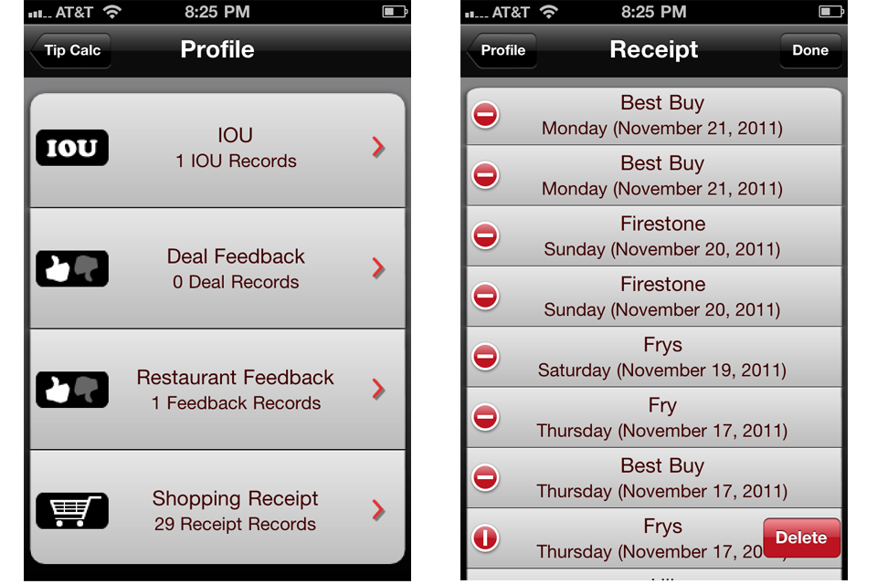

# MoneyCalculatorPlus 

iPhone & iPad App that incorporated an advanced calculator with social media features.

## Author's Notes:
Please note that this repository is a replica of my private project on GitHub. The project was written in Objective-C and hasn't been maintained for over 8 years, so it might not build. This is for reference only. I plan to update this project when I find time so that it will work in the latest Xcode environment.

## Developer's Partner:
I developed this application with my college friend, Wilson Kong.

## Overview

Money Calculator + is an Iphone and Ipad calculator with social media features.  It includes

1. Regular calculator with +, -, *, / operator functions
2. Unit converter that converts common units of measurement including length, temperature, area, volume, weight, etc.
3. Tip Calculator that computes total tips and split tips  

4. IOU Feature that keeps track of the amount of money owed  
   

5. Shopping List with a calculator
   

6. Social Media Feature for sharing restaurant rating, recipes, receipts, etc. with friends and family members

7. Support both audio and video recording to share shopping lists, receipt lists, and restaurant ratings with family and friends on Twitter, Facebook, Text, and Email.
   

8. All images and icons were custom-made using Adobe Photoshop.

